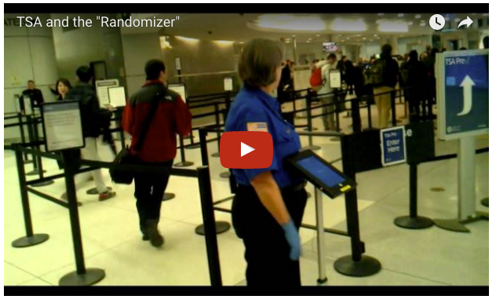
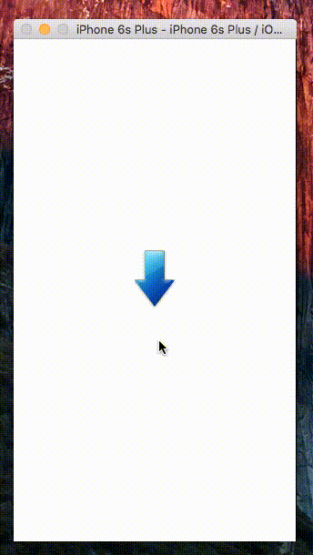

## What is this project for?

Inspired by:

[TSA paid $1.4 million for Randomizer app that chooses left or right](http://www.geek.com/apps/tsa-paid-1-4-million-for-randomizer-app-that-chooses-left-or-right-1651337/)

[TSA paid IBM $47,400 for an app that only pointed right or left](http://mashable.com/2016/04/04/tsa-ibm-randomizer-app/#aPKBU.b62Pqw)

[Guy makes 1.4 million dollar TSA app in 10 minutes](https://www.reddit.com/r/videos/comments/4deagz/)

[](https://youtu.be/P_KmFJ2gGzw)


## Technology used

* React-native
* Redux

## Why do this?

React Native enables you to build world-class application experiences on native platforms using a consistent developer experience based on JavaScript and React. 

This $1.4 million app is excellent for practise using the Redux structure to manage the React application.

This can be a new [To-Do mvc app](https://github.com/tastejs/todomvc) in Flux world to demostrate event based library e.g: Flux, Redux, Reflux, etc.

## Installation 

```
$ npm install 
```

Open in the iOS/Android project to compile and run.


## Output


